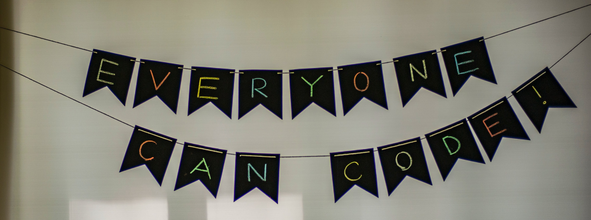

# Hi there, I'm Amanda :wave: :sunflower:

I'm the Digital Humanities and Learning Coordinator for SUNY Geneseo's Center for Digital Learning, and an aspirational developer! My previous work in open educational resources has inspired me to work in ways that democratize knowledge.

## Core Values

:yellow_circle: Openness

:cherry_blossom: Compassion

:open_book: Life-long Learning

:bulb: Curiosity

:seedling: Vulnerability

<!--
**ajeannette/ajeannette** is a ✨ _special_ ✨ repository because its `README.md` (this file) appears on your GitHub profile.

Here are some ideas to get you started:

- 🔭 I’m currently working on ...
- 🌱 I’m currently learning ...
- 👯 I’m looking to collaborate on ...
- 🤔 I’m looking for help with ...
- 💬 Ask me about ...
- 📫 How to reach me: ...
- 😄 Pronouns: ...
- ⚡ Fun fact: ...
-->
